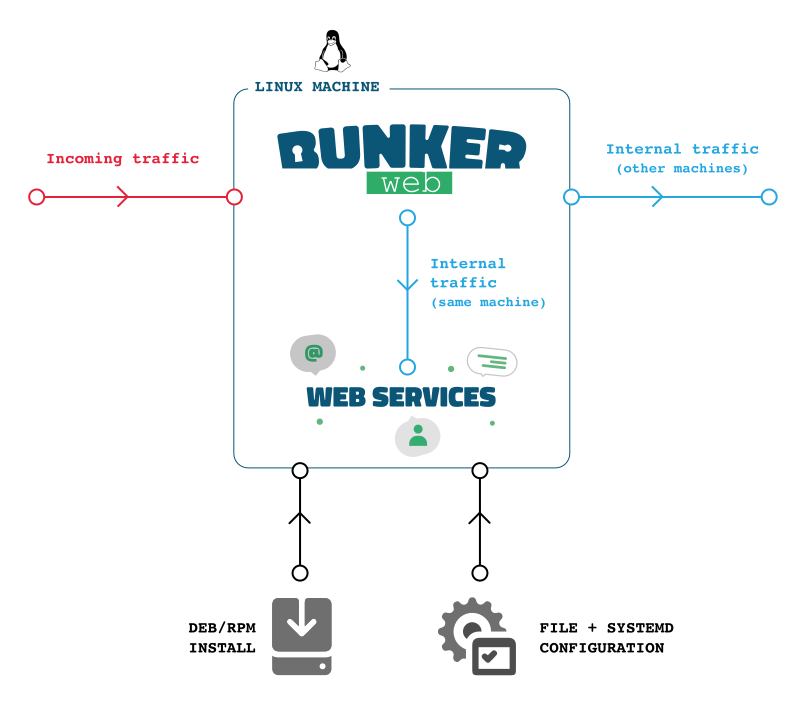

# NextCloudWAF

CTFd, in docker, but with a WAF

## Getting started

### Install prerequisites

#### Install Docker

See [official docs](https://docs.docker.com/engine/install/).

Or, if you're a clown:

```bash
curl https://get.docker.com/ | sh
```

#### Install `docker compose`

See [official docs](https://docs.docker.com/compose/install/).

#### Install `make`

```bash
sudo apt-get -y install make
```

### Cloning sources

```bash
make install
```

### Starting the containers

```bash
make up
```

### Stopping the containers

```bash
make down
```

### Cleaning up

```bash
make clean
```

## How does this project work?




## Contributing

We adhere to the following standards:

- Conventional commits
- branch naming: pseudonym/feature_name
- Peer review before merging

## Sources

Official CTFd repository: <https://github.com/CTFd/CTFd>

Official bunkerweb repository: <https://github.com/bunkerity/bunkerweb>
